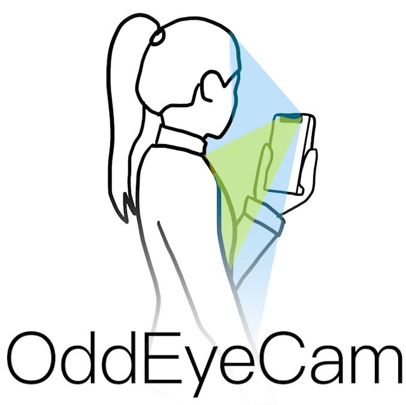
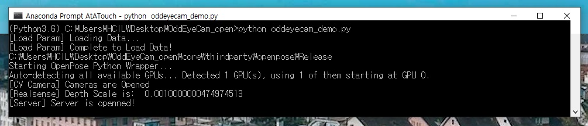
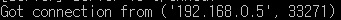
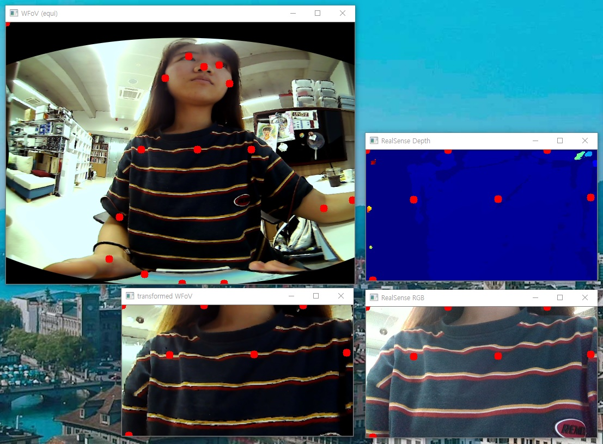
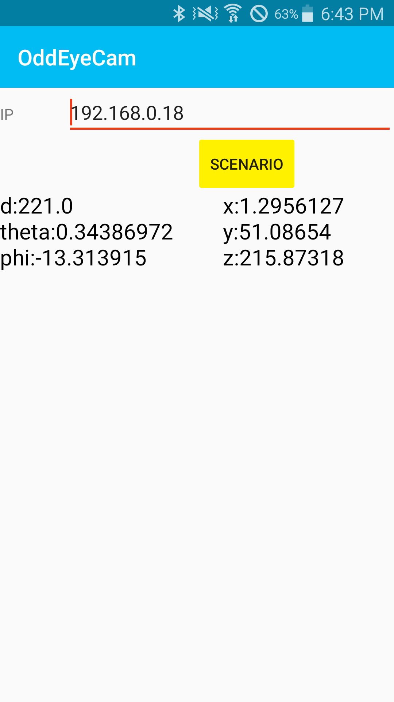

<p align="center">
    
</p>

-----------------

OddEyeCam is a practical inside-out mobile device tracking system to support body-centric peephole interaction. OddEyeCam tracks a user's body using a WFoV RGB camera and obtains precise depth information using an NFoV depth camera from a smartphone close to the body. This project was published in [UIST 2020](http://uist.acm.org/uist2020/).  
More info about this work can be found in:  
[[Project Video]](https://youtu.be/8N-UC3AqfAE) [[Paper (To Appear)]]()
<p align="center">
    
    <br>
    <sup>Some usage examples of OddEyeCam</sup>
</p>

## How to use

### Step 0: Camera Calibration
OddEyeCam combines WFoV RGB camera and NFoV depth camera. For this fusion process, we need to calibrate the cameras. For more details, please check the [calibration](https://github.com/KAIST-HCIL/OddEyeCam/tree/master/calibration) folder.

### Step 1: Install Requirements
- __Pose Estimation Module (OpenPose)__  
We used [OpenPose](https://github.com/CMU-Perceptual-Computing-Lab/openpose/blob/master/README.md) for body tracking. Please compile [OpenPose](https://github.com/CMU-Perceptual-Computing-Lab/openpose/blob/master/README.md) and place model, library files in [core/thirdparty/openpose/](https://github.com/KAIST-HCIL/OddEyeCam/tree/master/core/thirdparty) folder. If you are using Python3.6 on Windows, we provide these files to save your time. Please download them [here](https://drive.google.com/file/d/1W9XcH5y6mbULcdHEjV5QRXZ0w__A08F7/view?usp=sharing).
- __Android App__  
Our system needs an Android device because OddEyeCam 1) receives accelerometer data from the device and 2) visualizes the result on the app. Please download OddEyeCam [Android application package (APK)](https://drive.google.com/file/d/1r3HOWgwSr-nKmP_GT4WFvUjOl7_6V8s4/view?usp=sharing). Or, you can also modify and build this app. For more details, please check the [android](https://github.com/KAIST-HCIL/OddEyeCam/tree/master/android) folder.

### Step2: Run OddEyeCam on a Desktop
```bash
python oddeyecam_demo.py
```
After you run ```oddeyecam_demo.py```, you will see the line "[Server] Server is opened!". The program is waiting for the connection of an Android device. 
<p align="center">
    
    <br>
    <sup>After you run oddeyecam_demo.py. System is waiting for the connection of an Android device.</sup>
</p>

### Step3: Connect with Android Device

Please press the
 button
on the OddEyeCam Android app. After the connection, you will see  on the command, and then camera windows will appear.

<p align="center">
    
    
    <br>
    <sup>After the connection. Camera views are shown on the desktop's screen (left). Position data are shown on the mobile phone display (right).</sup>
</p>

If you want to stop camera streaming, then press the ```esc``` button on the camera windows.

### Step4: Demo Applications
If you want to use example application, please press
 button. Then you will see six applications:
- Drag and Drop between Apps
- Body-Centric Folder
- Large Image Viewer
- One-hand Tagging
- Getting Direction
- Marking Menus

## Why 'OddEye'Cam?
The name OddEyeCam was inspired by an [odd-eyed cat](https://en.wikipedia.org/wiki/Odd-eyed_cat). An odd-eyed cat is a cat  with one blue eye and one eye either green, yellow, or brown. Analogous to the cat with two eyes of different colors, we combine the following two types of cameras with different characteristics: an RGB camera with a wide field of view (WFoV) and a depth camera with a narrow field of view (NFoV). OddEyeCam finds body keypoints from a WFoV RGB image and uses par- tial depth information from a depth camera to track the body and estimate the device position relative to the body.

Btw, [I](https://daehwa.github.io/) love cats!