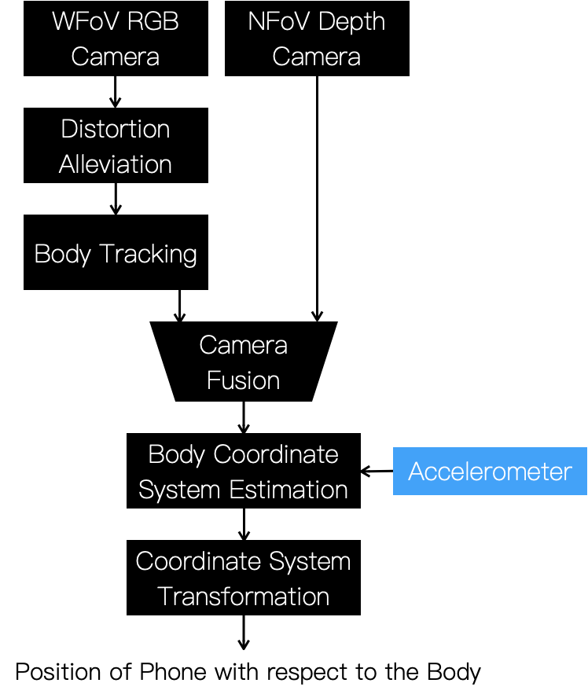
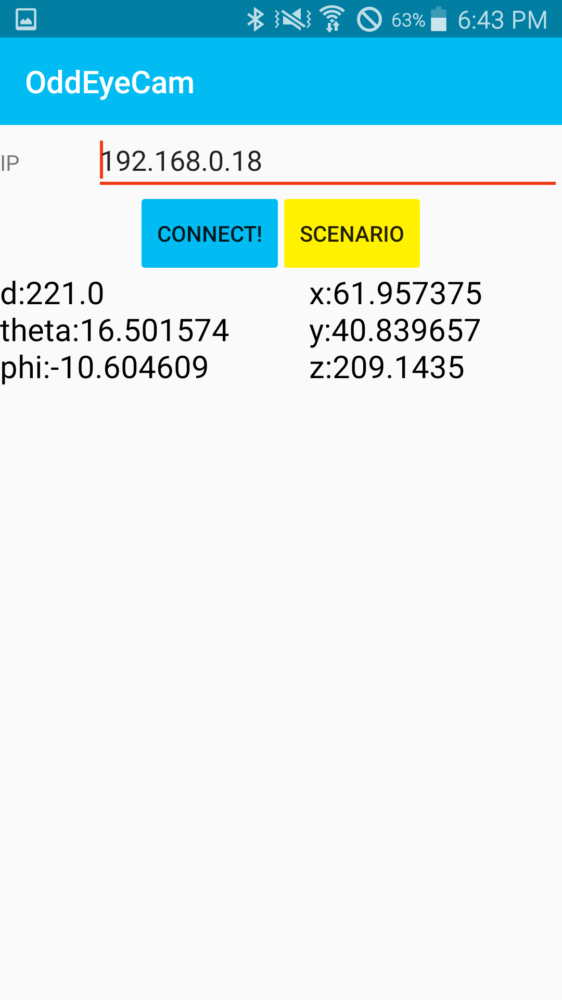
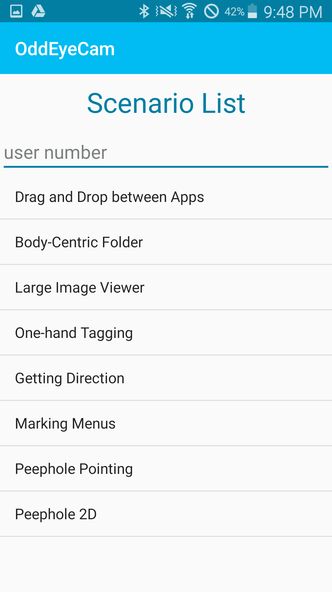

## Android App for Sensor data and Demos

An Android app is needed to obtain accelerometer data (below blue box) and visualize demo applications.
To install the Android app, you can just simply download [APK](https://drive.google.com/file/d/1r3HOWgwSr-nKmP_GT4WFvUjOl7_6V8s4/view?usp=sharing) or build this android project.

    
     
    Overall pipeline of OddEyeCam

Please change server ip on to your own. Real-time mobile device's position data is streamed on display.

    
    
     
    An Android app of OddEyeCam. Example interaction scenarios are available (right).

