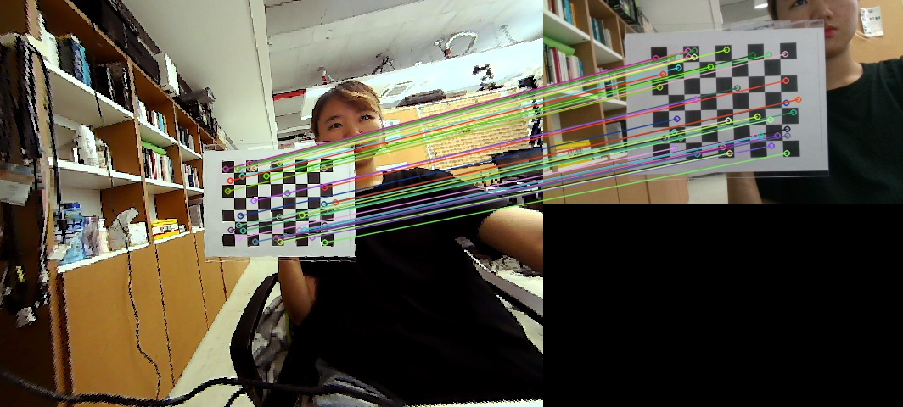

## Camera Calibration

Camera calibration process is needed to combine two cameras (below blue box).
<p align="center">
    
    <br>
    <sup>Overall pipeline of OddEyeCam</sup>
</p>

### Equirectangular Projection
<p align="center">
    
    
    <br>
    <sup>Result of equirectangular projection (right) on a fisheye image (left).</sup>
</p>

```bash
python generate_fisheye2equi_map.py
```

To make conversion map of fisheye to equirectangular image, we need to obtain intrinsic parameters of fisheye camera. We calibrated the fisheye camera using [OCamCalib](https://sites.google.com/site/scarabotix/ocamcalib-toolbox) (Omnidirectional Camera Calibration Toolbox for Matlab). Please change [```fisheye_model_intrinsic.csv```](https://github.com/KAIST-HCIL/OddEyeCam/blob/master/calibration/parameters/fisheye_model_intrinsic.csv) to your own. [```generate_fisheye2equi_map.py```](https://github.com/KAIST-HCIL/OddEyeCam/blob/master/calibration/generate_fisheye2equi_map.py) will give you conversion map of pixels of fisheye image to equirectangular image. The conversion map will be shown in the [parameters](https://github.com/KAIST-HCIL/OddEyeCam/tree/master/calibration/parameters) folder (```equi_u.csv``` and ```equi_v.csv```). Please change ```equi_u.csv``` and ```equi_v.csv``` files in [core/img_tool/cam_params/](https://github.com/KAIST-HCIL/OddEyeCam/tree/master/core/img_tool/cam_params) to your own.

### Perspective Projection
<p align="center">
    
    
    <br>
    <sup>Result of perspective projection (right) on a fisheye image (left).</sup>
</p>

```bash
python generate_fisheye2perspective.py
```

To make fisheye image like a normal field of view image, we used perspective projection. Please put checkerboard images in the [checkerboard_img](https://github.com/KAIST-HCIL/OddEyeCam/tree/master/calibration/checkerboard_img) folder. After you run [```generate_fisheye2perspective.py```](https://github.com/KAIST-HCIL/OddEyeCam/blob/master/calibration/generate_fisheye2perspective.py), you can see the [result](https://github.com/KAIST-HCIL/OddEyeCam/blob/master/calibration/output/fisheye2perspective_result.jpg) of perspective projection and obtain [```pinhole_model_intrinsic.json```](https://github.com/KAIST-HCIL/OddEyeCam/blob/master/calibration/parameters/pinhole_model_intrinsic.json). Please change [```pinhole_model_intrinsic.json```](https://github.com/KAIST-HCIL/OddEyeCam/blob/master/core/img_tool/cam_params/pinhole_model_intrinsic.json) in [core/img_tool/cam_params/](https://github.com/KAIST-HCIL/OddEyeCam/tree/master/core/img_tool/cam_params) to your own.

### Homography
<p align="center">
    
    
    
    <br>
    <sup>Result of homography transformation. A WFoV image (middle) is matched to an NFoV image.</sup>
</p>

```bash
python align_images.py 
```

In order to match a WFoV image to an NFoV image, we used homography. Please place a sheet to be parallel to two cameras (40 cm apart from cameras). And then please put two captured images taken from two cameras in the [calibration/40cm_checkerboard](https://github.com/KAIST-HCIL/OddEyeCam/tree/master/calibration/40cm_checkerboard) folder. [```align_images.py```](https://github.com/KAIST-HCIL/OddEyeCam/blob/master/calibration/align_images.py) will give you homography matrix. Please change [```homography_per2depth.xml```](https://github.com/KAIST-HCIL/OddEyeCam/blob/master/core/img_tool/cam_params/homography_per2depth.xml) to your own.